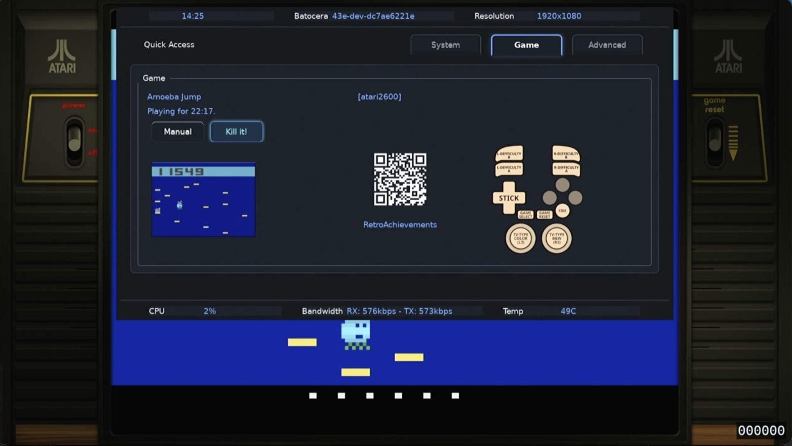

# Batocera Control Center

A flexible, XML-driven control panel for Batocera that provides an on-screen interface for system configuration and control. Works on both X11 and Wayland (Sway) with gamepad, touchscreen and keyboard support



## Features

- **Cross-platform**: Works on X11 and Wayland/Sway
- **Multiple input methods**: Keyboard, mouse, touchscreen, and gamepad (via evdev)
- **XML-driven UI**: Define your interface in a simple XML file
- **Live updates**: Display values update automatically from shell commands
- **Customizable styling**: GTK3 CSS for complete visual control
- **Auto-close**: Optional inactivity timeout
- **Modal dialogs**: Confirmation dialogs and choice popups
- **Flexible layout**: Horizontal and vertical groups with nested containers

## Quick Start

```bash
# Run with default configuration
./controlcenter.py

# Run with custom XML and CSS
./controlcenter.py /path/to/config.xml /path/to/style.css

# Run with 10-second inactivity timeout
./controlcenter.py controlcenter.xml style.css 10
```

## File Locations

When run without arguments, the application searches for configuration files in this priority order:

1. **User overrides**: `/userdata/system/configs/controlcenter/`
2. **System defaults**: `/usr/share/batocera/controlcenter/`
3. **Local directory**: Same directory as `controlcenter.py`

This allows users to customize their configuration without modifying system files.

## Command Line Parameters

```
./controlcenter.py [--fullscreen] [--window WIDTHxHEIGHT] [--hidden] [timeout] [xml_path] [css_path]
```

**Options:**
- `--fullscreen`: Run in fullscreen mode (covers entire screen)
- `--window WIDTHxHEIGHT`: Set custom window size (e.g., `--window 800x600`)
- `--hidden`: Start with window hidden (useful for background processes)

**Positional arguments:**
- `timeout`: Inactivity timeout in seconds (default: 0 = never close)
  - Timer resets on any user interaction (navigation, button clicks)
  - Window also closes when losing focus (clicking outside)
- `xml_path`: Path to XML configuration file (default: auto-detected)
- `css_path`: Path to CSS stylesheet (default: auto-detected)

**Examples:**
```bash
# Run in fullscreen mode
./controlcenter.py --fullscreen

# Run with custom window size
./controlcenter.py --window 1024x768

# Run fullscreen with 30-second timeout
./controlcenter.py --fullscreen 30

# Run with custom size and configuration files
./controlcenter.py --window 800x600 config.xml style.css

# Start hidden (can be shown later with SIGUSR1)
./controlcenter.py --hidden
```

**Window Modes:**
- **Default**: Responsive window size based on screen resolution (70-90% of screen width)
- **Fullscreen**: Covers entire screen, removes window decorations
- **Custom size**: Fixed dimensions, allows resizing for custom window sizes
- **Hidden**: Window exists but is not visible (useful for daemon-like operation)

## XML Configuration

### Basic Structure

```xml
<features>
  <hgroup display="Group Title">
    <vgroup>
      <feature display="Feature Name">
        <!-- Controls go here -->
      </feature>
    </vgroup>
  </hgroup>
</features>
```

### Universal Attributes

These attributes can be used on any element:

#### `id` - Element Identifier
Assigns a unique identifier to an element for conditional rendering.

```xml
<text id="public_ip" display="${curl ifconfig.me}" />
```

#### `if` - Conditional Rendering
Controls whether an element is rendered based on a condition.

**Supported conditions:**

1. **Check if another element is rendered:**
   ```xml
   <!-- Show only if element with id="cheevos" is rendered -->
   <text if="id(cheevos)" display="Achievements enabled!" />
   ```

2. **Check if another element is NOT rendered:**
   ```xml
   <!-- Show only if element with id="cheevos" is NOT rendered -->
   <text if="!id(cheevos)" display="Achievements disabled" />
   ```

3. **Check shell command output:**
   ```xml
   <!-- Show only if command returns non-empty string -->
   <feature if="${pgrep emulatorlauncher}" display="Game Running">
     <text display="A game is currently running" />
   </feature>
   ```

4. **Feature-level conditionals:**
   ```xml
   <!-- Entire feature is hidden if condition fails -->
   <feature display="Brightness Control" if='${printf "%s" $(batocera-brightness 2&gt;/dev/null)}'>
     <button display="Bright -" action="batocera-brightness - 20" />
     <text display="${batocera-brightness}%" refresh="1" />
     <button display="Bright +" action="batocera-brightness + 20" />
   </feature>
   ```

- **Feature-level conditionals**: When applied to `<feature>` elements, the entire feature (including label and all controls) is hidden if the condition fails
- **Performance**: Feature-level conditionals are more efficient than individual element conditionals when hiding entire sections
- **Null handling**: Commands that return "null" (case-insensitive) are treated as empty results and will cause the condition to fail


**Examples:**

```xml
<!-- Conditional game info - only show if emulator is running -->
<hgroup display="Game Info" if="${pgrep emulatorlauncher}">
  <vgroup>
    <feature display="Current Game">
      <text display="${get-current-game}" />
    </feature>
  </vgroup>
</hgroup>

<!-- Show different messages based on achievement status -->
<text id="achievements" display="${check-achievements}" />
<text if="id(achievements)" display="Achievements Active" />
<text if="!id(achievements)" display="Achievements Disabled" />
```

### Container Elements

#### `<hgroup>` - Horizontal Group
Creates a titled section with a frame border.

```xml
<hgroup display="Sound Parameters">
  <!-- Content -->
</hgroup>
```

**Attributes:**
- `display`: Group title (optional, omit for no frame)

#### `<vgroup>` - Vertical Group
Creates a row of cells displayed horizontally. Can be used at root level or inside `<hgroup>`.

```xml
<vgroup>
  <feature display="Volume">
    <button display="Vol -" action="amixer set Master 5%-" />
    <text display="${amixer get Master | grep -o '[0-9]*%' | head -1}" />
    <button display="Vol +" action="amixer set Master 5%+" />
  </feature>
</vgroup>
```

**Special attribute:**
- `role="header"`: Makes the vgroup non-selectable and displays at the top (for status bars)
- `role="footer"`: Same as "header" but displays at the bottom

#### `<feature>` - Feature Row
A single row containing a label and controls.

```xml
<feature display="Power Mode">
  <text display="${cat /sys/devices/system/cpu/cpufreq/policy0/scaling_governor}" />
  <choice display="Performance" action="cpufreq-set -g performance" />
  <choice display="Powersave" action="cpufreq-set -g powersave" />
</feature>
```

**Attributes:**
- `display`: Label text
- `name`: Alternative to display (deprecated)

### Control Elements

#### `<button>` - Action Button
Executes a shell command when clicked.

```xml
<button display="Reboot" action="systemctl reboot" />
<button display="Restart and Close" action="systemctl restart batocera" afterclick="bcc_close" />
<button display="Update and Reboot" action="batocera-upgrade" afterclick="${reboot}" />
```

**Attributes:**
- `display`: Button label
- `action`: Shell command to execute
- `afterclick`: Command or action to execute after the main action completes (optional)
  - Use `afterclick="bcc_close"` to close all BCC windows
  - Use `afterclick="${command}"` to execute a shell command
  - Use `afterclick="direct_command"` to execute a direct command
- `align`: Button alignment - `left`, `center` (default), or `right`

#### `<button_confirm>` - Confirmation Button
Shows a confirmation dialog before executing the action.

```xml
<button_confirm display="Kill Emulator" action="killall emulatorlauncher" />
<button_confirm display="Touchscreen keyboard" action="onscreen-keyboard-toggle" afterclick="bcc_close" />
```

**Attributes:**
- `display`: Button label (also used in confirmation message)
- `action`: Shell command to execute after confirmation
- `afterclick`: Command or action to execute after the main action completes (optional)

#### `<toggle>` - Toggle Switch
A switch that executes different commands for ON/OFF states.

```xml
<toggle
  value="${batocera-audio getSystemMute}"
  action_on="batocera-audio setSystemVolume mute"
  action_off="batocera-audio setSystemVolume unmute" />
<toggle
  value="${wifi-status}"
  action_on="enable-wifi"
  action_off="disable-wifi"
  afterclick="bcc_close" />
```

**Attributes:**
- `value`: Command to get current state (returns "true"/"false", "1"/"0", "on"/"off", etc.)
- `display`: Command to get display value (optional, shows as label if provided)
- `action_on`: Command to execute when turning ON
- `action_off`: Command to execute when turning OFF
- `afterclick`: Command or action to execute after the main action completes (optional)
- `refresh`: Update interval in seconds (default: 0 = no refresh). Can be integer or float (e.g., `1`, `0.5`, `2.5`)
- `align`: Toggle alignment - `left`, `center` (default), or `right`

#### `<switch>` - Modern Switch Widget
A modern switch widget (GtkSwitch) that executes different commands for ON/OFF states. Has the same functionality as `<toggle>` but with a different visual appearance.

```xml
<switch
  value="${batocera-planemode status}"
  action_on="batocera-planemode enable"
  action_off="batocera-planemode disable" />
<switch
  value="${bluetooth-status}"
  action_on="enable-bluetooth"
  action_off="disable-bluetooth"
  afterclick="${restart-services}" />
```

**Attributes:**
- `value`: Command to get current state (returns "true"/"false", "1"/"0", "on"/"off", etc.)
- `display`: Command to get display value (optional, shows as label if provided)
- `action_on`: Command to execute when turning ON
- `action_off`: Command to execute when turning OFF
- `afterclick`: Command or action to execute after the main action completes (optional)
- `refresh`: Update interval in seconds (default: 0 = no refresh). Can be integer or float (e.g., `1`, `0.5`, `2.5`)
- `align`: Switch alignment - `left`, `center` (default), or `right`

**Notes:**
- Identical functionality to `<toggle>` but uses a modern switch appearance
- Better for binary on/off settings
- Supports the same state detection as toggle (true/false, 1/0, on/off, yes/no, enabled/disabled)

### Afterclick Actions

The `afterclick` attribute is available on all interactive elements (`button`, `button_confirm`, `toggle`, `switch`, `choice`) and allows you to execute additional commands after the main action completes.

**Special Values:**
- `afterclick="bcc_close"`: Hides the Batocera Control Center window (keeps app running in background)
- `afterclick="${command}"`: Executes a shell command with variable substitution
- `afterclick="direct_command"`: Executes a direct shell command

**Examples:**
```xml
<!-- Hide BCC after action -->
<button display="Toggle Keyboard" action="onscreen-keyboard-toggle" afterclick="bcc_close" />

<!-- Chain commands -->
<button display="Update System" action="batocera-upgrade" afterclick="${systemctl reboot}" />

<!-- Hide BCC after changing power mode -->
<choice display="Performance" action="cpufreq-set -g performance" afterclick="bcc_close" />

<!-- Restart services after toggle -->
<toggle action_on="enable-wifi" action_off="disable-wifi" afterclick="${systemctl restart networking}" />
```

#### `<text>` - Display Text
Shows static text or dynamic output from a command.

```xml
<!-- Static text -->
<text display="Hello World" />

<!-- Dynamic text from command -->
<text display="${date +'%H:%M:%S'}" refresh="1" />

<!-- Command expansion in text -->
<text display="Load avg: ${cat /proc/loadavg | cut -d' ' -f1}%" />
```

**Attributes:**
- `display`: Text to display or `${command}` for dynamic content
- `refresh`: Update interval in seconds (default: 0 = no refresh). Can be integer or float (e.g., `1`, `0.5`, `2.5`)
- `align`: Text alignment - `left`, `center` (default), or `right`

**Command formats:**
- `${command}`: Single command, output replaces entire text
- `Text ${cmd1} more ${cmd2}`: Multiple commands embedded in text

#### `<choice>` - Choice Option
Creates a "Select" button that opens a popup with multiple choices.

```xml
<feature display="Power Mode">
  <text display="${cat /sys/devices/system/cpu/cpufreq/policy0/scaling_governor}" />
  <choice display="Performance" action="cpufreq-set -g performance" />
  <choice display="Powersave" action="cpufreq-set -g powersave" />
  <choice display="Ondemand" action="cpufreq-set -g ondemand" afterclick="bcc_close" />
</feature>
```

**Attributes:**
- `display`: Option label in the popup
- `action`: Shell command to execute when selected
- `afterclick`: Command or action to execute after the main action completes (optional)

#### `<tab>` - Tab Navigation
Creates clickable tabs that switch between different content sections. Tabs must be defined in a feature, and each tab targets an `<hgroup>` by its `name` attribute.

```xml
<!-- Define tabs -->
<feature name="main_tabs" display="Navigation">
  <tab display="System" target="System" />
  <tab display="Games" target="Games" />
  <tab display="Network" target="Network" />
</feature>

<!-- Define tab content - each hgroup is a tab panel -->
<hgroup name="System" display="System Settings">
  <vgroup>
    <feature display="CPU">
      <text display="${cat /proc/cpuinfo | grep 'model name' | head -1 | cut -d: -f2}" />
    </feature>
  </vgroup>
</hgroup>

<hgroup name="Games" display="Game Library">
  <vgroup>
    <feature display="Total Games">
      <text display="${find /userdata/roms -name '*.zip' | wc -l}" />
    </feature>
  </vgroup>
</hgroup>

<hgroup name="Network" display="Network Status">
  <vgroup>
    <feature display="IP Address">
      <text display="${hostname -I | awk '{print $1}'}" />
    </feature>
  </vgroup>
</hgroup>
```

**Attributes:**
- `display`: Tab label text (shown on the tab button)
- `target`: Name of the `<hgroup>` to show when this tab is selected (must match an hgroup's `name` attribute)

**Notes:**
- Tabs are defined in a `<feature>` element, typically at the top of your XML
- Each tab's `target` must match the `name` attribute of an `<hgroup>`
- Only one tab's content is visible at a time
- The first tab is selected by default
- Tab content is stacked vertically when multiple vgroups are present
- Tabs can be navigated with keyboard (Left/Right arrows) or gamepad (D-Pad Left/Right)
- Clicking a tab or pressing Enter/A button activates it

**Example with multiple content sections:**

```xml
<features>
  <!-- Tab navigation -->
  <feature name="tabs" display="Quick Access">
    <tab display="Audio" target="audio_settings" />
    <tab display="Video" target="video_settings" />
    <tab display="Controls" target="control_settings" />
  </feature>
  
  <!-- Audio tab content -->
  <hgroup name="audio_settings" display="Audio Settings">
    <vgroup>
      <feature display="Volume">
        <button display="Vol -" action="amixer set Master 5%-" />
        <text display="${amixer get Master | grep -o '[0-9]*%' | head -1}" />
        <button display="Vol +" action="amixer set Master 5%+" />
      </feature>
    </vgroup>
  </hgroup>
  
  <!-- Video tab content -->
  <hgroup name="video_settings" display="Video Settings">
    <vgroup>
      <feature display="Resolution">
        <text display="${xrandr | grep '*' | awk '{print $1}'}" />
      </feature>
    </vgroup>
  </hgroup>
  
  <!-- Controls tab content -->
  <hgroup name="control_settings" display="Control Settings">
    <vgroup>
      <feature display="Gamepad">
        <text display="${ls /dev/input/js* 2>/dev/null | wc -l} connected" />
      </feature>
    </vgroup>
  </hgroup>
</features>
```

#### `` - Image Display
Shows an image from a file, URL, or command output. **Supports animated GIFs with CPU optimization and scaling!**

```xml
<!-- Static image file -->


<!-- Animated GIF (optimized for low CPU usage) -->


<!-- Animated GIF with height constraint (frames scaled on-the-fly) -->


<!-- Animated GIF with custom settings -->


<!-- Disable animation (show first frame only) -->


<!-- Image from URL -->


<!-- Dynamic image path from command -->


<!-- Images with percentage dimensions -->


```

**Attributes:**
- `display`: File path, URL, or `${command}` that returns a path
- `width`: Image width in pixels or percentage (e.g., `100` or `50%`) (optional)
- `height`: Image height in pixels or percentage (e.g., `150` or `20%`) (optional)
- `refresh`: Update interval in seconds (default: 0 = no refresh). Can be integer or float (e.g., `1`, `0.5`, `2.5`)
- `align`: Image alignment - `left`, `center` (default), or `right`
- `animate`: Enable/disable GIF animation - `true` (default) or `false`

**Notes:**
- If only width or height is specified, aspect ratio is preserved
- Supports common formats: PNG, JPEG, GIF, etc.
- **Animated GIFs**: Automatically detected and played with full animation support
- **Animated GIF Scaling**: Frames are scaled on-the-fly to match specified dimensions (width/height)
- **CPU Optimization**: GIF animations are frame-rate limited (default: 15 FPS) and paused when window is hidden
- **Percentage dimensions**: Width/height can be specified as percentages (e.g., `width="50%"`) relative to the window size
- Percentages are calculated based on actual window dimensions when available, with fallback to 800x600 reference
- **Performance Note**: Scaling animated GIFs requires per-frame scaling which uses more CPU than static images. For best performance, pre-scale GIF files to desired size.

**Environment Variables for GIF Optimization:**
- `BCC_MAX_GIF_FPS=15` - Maximum frames per second for animated GIFs (default: 15). Set to 0 for unlimited.
- `BCC_ENABLE_GIF_ANIMATIONS=0` - Disable all GIF animations globally (shows first frame only). Default: enabled.

#### `<qrcode>` - QR Code Display
Generates and displays a QR code from text, URL, or command output. Requires the `qrcode` Python library (installed by default on Batocera).

```xml
<!-- Static QR code from URL -->
<qrcode display="https://batocera.org" width="150" height="150" />

<!-- Static QR code from text, with a dark background -->
<qrcode display="Hello World" bg="#141821" />

<!-- Dynamic QR code from command -->
<qrcode display="${echo https://example.com/status}" refresh="1" />

<!-- QR codes with percentage dimensions -->
<qrcode display="https://batocera.org" width="15%" />
<qrcode display="${get_wifi_qr}" height="25%" style="card" logo="wifi.png" text="Connect" font="/usr/share/fonts/truetype/dejavu/DejaVuSans.ttf"  />
```

**Attributes:**
- `display`: Text, URL, or `${command}` that returns data to encode as QR code
- `width`: QR code width in pixels or percentage (e.g., `200` or `15%`) (optional, default: 200)
- `height`: QR code height in pixels or percentage (e.g., `200` or `25%`) (optional, default: 200)
- `refresh`: Update interval in seconds (default: 0 = no refresh). Can be integer or float (e.g., `1`, `0.5`, `2.5`)
- `align`: QR code alignment - `left`, `center` (default), or `right`
- `bg`: HTML hex code for the background of the QR code - foreground color will be contrasting white or black automatically
- `style`: you can embed the QR code in a `card` with an optional `logo` on top and footer `text` rendered with the provided `font` type

**Notes:**
- Requires `qrcode` Python library (already installed on Batocera)
- QR codes are generated as black on white background
- QR codes are always square - if only width or height is specified, both dimensions will use that value
- If neither width nor height is specified, defaults to 200x200 pixels
- Useful for sharing URLs, WiFi credentials, or dynamic status information
- **Percentage dimensions**: Width/height can be specified as percentages (e.g., `width="15%"`) relative to the window size
- Percentages are calculated based on actual window dimensions when available, with fallback to 800x600 reference
- `text` and `logo` are valid only with `style="card"`

#### `<progressbar>` - Progress Bar Display
Displays a progress bar with a numeric value below it. Shows progress as a visual bar and text value.

```xml
<!-- Static progress bar -->
<progressbar display="75" min="0" max="100" />

<!-- Dynamic progress bar from command -->
<progressbar display="${df -h /userdata | awk 'NR==2 {print $5}' | sed 's/%//'}" min="0" max="100" refresh="5" />

<!-- Battery level with custom range -->
<progressbar display="${cat /sys/class/power_supply/BAT0/capacity}" min="0" max="100" refresh="10" />

<!-- Temperature with custom range -->
<progressbar display="${sensors | grep 'Core 0' | awk '{print $3}' | sed 's/+//;s/°C//'}" min="20" max="80" refresh="2" />
```

**Attributes:**
- `display`: Static value or `${command}` that returns a numeric value
- `min`: Minimum value for the progress bar range (optional, default: 0)
- `max`: Maximum value for the progress bar range (optional, default: 100)
- `refresh`: Update interval in seconds (default: 0 = no refresh). Can be integer or float (e.g., `1`, `0.5`, `2.5`)
- `align`: Progress bar alignment - `left`, `center` (default), or `right`

**Notes:**
- Values are automatically clamped to the min/max range
- If the command returns non-numeric text, the function tries to extract the first number found
- The progress bar shows both a visual bar and the numeric value below it
- Values are displayed as integers when whole numbers, or with one decimal place for fractals
- Progress bar uses the same color scheme as other UI elements (blue gradient)

#### `<doc>` - Document Viewer Button
Creates a button that opens a fullscreen viewer for documents including PDFs, images, comic book archives (CBZ), and plain text files.

```xml
<!-- View a local PDF -->
<doc display="View Manual" content="/userdata/roms/atari2600/manuals/manual.pdf" />

<!-- View a comic book archive -->
<doc display="View Comic" content="/userdata/library/comic.cbz" />

<!-- View a text file -->
<doc display="View Log" content="/var/log/system.log" />

<!-- View from URL -->
<doc display="Online Doc" content="https://example.com/document.pdf" />

<!-- Dynamic path from command -->
<doc display="Latest screenshot" content="${find /userdata/screenshots -name 'screenshot*.png' | head -1}" />
```

**Attributes:**
- `display`: Button label text (required)
- `content`: File path or URL to document (required). Can be `${command}` for dynamic paths
- `align`: Button alignment - `left`, `center` (default), or `right`
- `refresh`: Update interval in seconds (default: 0 = no refresh). Can be integer or float (e.g., `1`, `0.5`)

**Supported formats:**
- **PDF**: Requires `pdftoppm` and `pdfinfo` (usually pre-installed on Batocera)
  - Multi-page navigation with Previous/Next buttons
  - Gamepad: Left/Right or A button to navigate, Up/Down to zoom in/out, Right analog stick for continuous panning, B to close
- **CBZ**: Comic Book Archive (ZIP file containing images)
  - Multi-page navigation with Previous/Next buttons
  - Images sorted naturally by filename
  - Gamepad: Left/Right or A button to navigate, Up/Down to zoom in/out, Right analog stick for continuous panning, B to close
- **Images**: JPG, PNG, GIF, and other formats supported by GdkPixbuf
  - Gamepad: Up/Down to zoom in/out, Right analog stick for continuous panning, A or B button to close
- **Text files**: TXT, LOG, MD, CONF, CFG, INI, JSON, XML, YAML, YML
  - Scrollable text view with monospace font
  - Font size controlled by CSS (`.doc-viewer-text` class)
  - Gamepad: Up/Down to zoom in/out (font size), Right analog stick for continuous panning/scrolling, A or B button to close

**Notes:**
- Opens in fullscreen overlay window
- PDFs are rendered at 120 DPI for good quality
- CBZ files are extracted and images displayed in natural sort order
- Images and text are automatically scaled/formatted to fit screen
- Supports both local files and HTTP/HTTPS URLs
- Text files use UTF-8 encoding with error replacement for invalid characters
- **Zoom functionality**: Use gamepad Up/Down or keyboard to zoom in/out on all content types
  - Images/PDFs/CBZ: Zoom range 20% to 500%
  - Text files: Font size zoom for better readability
- **Pan functionality**: Use right analog stick to pan around zoomed content
  - **Continuous panning**: Hold the right analog stick in any direction for smooth, continuous scrolling
  - Works with all content types when zoomed in
  - Smooth scrolling for precise navigation

### Refresh Behavior

By default, elements do not refresh automatically (`refresh="0"`). This reduces CPU usage for static content. For dynamic elements that need periodic updates, explicitly set a refresh interval in seconds (e.g., `refresh="1"` or `refresh="0.5"`).

**Elements that typically need refresh:**
- System information (CPU usage, memory, temperature)
- Time displays
- Running game information
- Volume levels
- Toggle states that can change externally
- Dynamic QR codes (e.g., for changing URLs or status)

**Elements that don't need refresh:**
- Static text and labels
- Buttons (they execute commands on click)
- Choice options
- Static images and QR codes

**Example:**
```xml
<!-- Static text - no refresh needed -->
<text display="System Settings" />

<!-- Dynamic CPU usage - refresh every second -->
<text display="${top -bn1 | grep 'Cpu(s)' | awk '{print $2}'}%" refresh="1" />

<!-- Fast refresh for time display (twice per second) -->
<text display="${date +'%H:%M:%S.%N' | cut -c1-12}" refresh="0.5" />

<!-- Volume that updates when buttons are clicked - needs refresh to show external changes -->
<text display="${batocera-audio getSystemVolume}%" refresh="1" />

<!-- Static QR code - no refresh needed -->
<qrcode display="https://batocera.org" width="150" height="150" />

<!-- Dynamic QR code that updates every 5 seconds -->
<qrcode display="${echo http://192.168.1.1:8080/status}" refresh="5" />

<!-- Slow refresh for less critical info (every 2.5 seconds) -->
<text display="${uptime -p}" refresh="2.5" />
```

#### `<qrcode>` - QR Code Display
Generates and displays a QR code from text, URL, or command output. Requires the `qrcode` Python library (installed by default on Batocera).

```xml
<!-- Static QR code from URL -->
<qrcode display="https://batocera.org" width="150" height="150" />

<!-- Static QR code from text -->
<qrcode display="Hello World" />

<!-- Dynamic QR code from command -->
<qrcode display="${echo https://example.com/status}" refresh="1" />
```

**Attributes:**
- `display`: Text, URL, or `${command}` that returns data to encode as QR code
- `width`: QR code width in pixels (optional, default: 200)
- `height`: QR code height in pixels (optional, default: 200)
- `refresh`: Update interval in seconds (default: 0 = no refresh). Can be integer or float (e.g., `1`, `0.5`, `2.5`)
- `align`: QR code alignment - `left`, `center` (default), or `right`

**Notes:**
- Requires `qrcode` Python library (already installed on Batocera)
- QR codes are generated as black on white background
- QR codes are always square - if only width or height is specified, both dimensions will use that value
- If neither width nor height is specified, defaults to 200x200 pixels
- Useful for sharing URLs, WiFi credentials, or dynamic status information

#### `<pdf>` - PDF/Image Viewer Button
Creates a button that opens a fullscreen viewer for PDFs or images.

```xml
<!-- View a local PDF -->
<pdf name="View Manual" display="/usr/share/docs/manual.pdf" />

<!-- View an image -->
<pdf name="View Screenshot" display="/tmp/screenshot.png" />

<!-- View from URL -->
<pdf name="Online Doc" display="https://example.com/document.pdf" />

<!-- Dynamic path from command -->
<pdf name="Latest Log" display="${find /var/log -name '*.pdf' | head -1}" />
```

**Attributes:**
- `name`: Button label text (required)
- `display`: File path or URL to PDF/image (required). Can be `${command}` for dynamic paths
- `align`: Button alignment - `left`, `center` (default), or `right`

**Supported formats:**
- **PDF**: Requires `pdftoppm` and `pdfinfo` (from poppler-utils package)
  - Multi-page navigation with Previous/Next buttons
  - Gamepad: Left/Right or A button to navigate, B to close
- **Images**: JPG, PNG, GIF, and other formats supported by GdkPixbuf
  - Gamepad: A or B button to close

**Notes:**
- Opens in fullscreen overlay window
- PDFs are rendered at 150 DPI for good quality
- Images are automatically scaled to fit screen
- Supports both local files and HTTP/HTTPS URLs
- Requires `pdftoppm` and `pdfinfo` commands (usually pre-installed on Batocera)

### Refresh Behavior

By default, elements do not refresh automatically (`refresh="0"`). This reduces CPU usage for static content. For dynamic elements that need periodic updates, explicitly set a refresh interval in seconds (e.g., `refresh="1"` or `refresh="0.5"`).

**Elements that typically need refresh:**
- System information (CPU usage, memory, temperature)
- Time displays
- Running game information
- Volume levels
- Toggle states that can change externally
- Dynamic QR codes (e.g., for changing URLs or status)

**Elements that don't need refresh:**
- Static text and labels
- Buttons (they execute commands on click)
- Choice options
- Static images and QR codes

**Example:**
```xml
<!-- Static text - no refresh needed -->
<text display="System Settings" />

<!-- Dynamic CPU usage - refresh every second -->
<text display="${top -bn1 | grep 'Cpu(s)' | awk '{print $2}'}%" refresh="1" />

<!-- Fast refresh for time display (twice per second) -->
<text display="${date +'%H:%M:%S.%N' | cut -c1-12}" refresh="0.5" />

<!-- Volume that updates when buttons are clicked - needs refresh to show external changes -->
<text display="${batocera-audio getSystemVolume}%" refresh="1" />

<!-- Static QR code - no refresh needed -->
<qrcode display="https://batocera.org" width="150" height="150" />

<!-- Dynamic QR code that updates every 5 seconds -->
<qrcode display="${echo http://192.168.1.1:8080/status}" refresh="5" />

<!-- Slow refresh for less critical info (every 2.5 seconds) -->
<text display="${uptime -p}" refresh="2.5" />
```

### Layout Examples

#### Header Status Bar

```xml
<vgroup role="header">
  <feature name="Time">
    <text display="${date +'%H:%M:%S'}" refresh="1" />
  </feature>
  <feature display="CPU">
    <text display="${top -bn1 | grep 'Cpu(s)' | awk '{print $2}'}%" refresh="1" />
  </feature>
</vgroup>
```

#### Volume Control

```xml
<hgroup display="Sound Parameters">
  <vgroup>
    <feature>
      <button display="Vol -" action="batocera-audio setSystemVolume -5" />
      <text display="${batocera-audio getSystemVolume}%" refresh="1" />
      <button display="Vol +" action="batocera-audio setSystemVolume +5" />
    </feature>
    <feature display="Mute Sound">
      <toggle
        value="${batocera-audio getSystemMute}"
        action_on="batocera-audio setSystemVolume mute"
        action_off="batocera-audio setSystemVolume unmute"
        refresh="1" />
    </feature>
  </vgroup>
</hgroup>
```

#### Power Management with Choices

```xml
<hgroup display="Power Parameters">
  <vgroup>
    <feature display="Power Mode">
      <text display="${cat /sys/devices/system/cpu/cpufreq/policy0/scaling_governor}" refresh="1" />
      <choice display="Performance" action="cpufreq-set -g performance" />
      <choice display="Powersave" action="cpufreq-set -g powersave" />
      <choice display="Ondemand" action="cpufreq-set -g ondemand" />
    </feature>
  </vgroup>
</hgroup>
```

#### Network Information with QR Code

```xml
<hgroup display="Network Info">
  <vgroup>
    <feature display="ES Web Interface">
      <qrcode display="${echo http://$(hostname -s | awk '{print $1}'):1234}" width="150" height="150" refresh="5" />
    </feature>
  </vgroup>
</hgroup>
```

## CSS Styling

The interface uses GTK3 CSS for styling. All elements have CSS classes for customization.

### Available CSS Classes

```css
/* Main window */
.popup-root { }

/* Groups */
.group-frame { }
.group-title { }

/* Rows */
.vgroup-row { }
.vgroup-cell { }
.vgroup-cell-first { }

/* Text and labels */
.item-text { }
.value { }
.header { }

/* Buttons */
.cc-button { }
.cc-toggle { }
.cc-choice { }
.cc-button-confirm { }

/* Selection states */
.focused { }
.focused-cell { }
.choice-selected { }

/* Dialogs */
.confirm-dialog { }
.choice-option { }

/* Separators */
.section-separator { }
```

### Example Stylesheet

```css
/* Main window background */
.popup-root {
  background-color: rgba(20, 20, 20, 0.95);
  color: #ffffff;
}

/* Group frames */
.group-frame {
  border: 2px solid #444444;
  border-radius: 8px;
  background-color: rgba(30, 30, 30, 0.8);
  margin: 8px;
  padding: 8px;
}

.group-title {
  color: #00d4ff;
  font-size: 16px;
  font-weight: bold;
}

/* Buttons */
.cc-button {
  background-color: #333333;
  color: #ffffff;
  border: 2px solid #555555;
  border-radius: 6px;
  padding: 8px 16px;
  min-width: 80px;
}

.cc-button:hover {
  background-color: #444444;
  border-color: #00d4ff;
}

/* Selected button */
.focused-cell,
.choice-selected {
  background-color: #00a8cc !important;
  border-color: #00d4ff !important;
}

/* Toggle switches */
.cc-toggle {
  background-color: #555555;
  border: 2px solid #777777;
  border-radius: 20px;
  padding: 6px 20px;
  min-width: 60px;
}

.cc-toggle:checked {
  background-color: #00cc66;
  border-color: #00ff88;
}

/* Text values */
.value {
  color: #00d4ff;
  font-size: 14px;
  font-weight: bold;
}
```

## Input Controls

### Keyboard

- **Arrow Keys**: Navigate between controls
  - Up/Down: Move between rows
  - Left/Right: Move between controls in a row or vgroup
- **Enter/Space**: Activate selected control
- **Escape**: Close window or dialog

### Gamepad

The application uses evdev for gamepad support with exclusive access (prevents EmulationStation from receiving inputs while the control center is open).

#### Main Window Navigation
- **D-Pad/Left Stick**: Navigate between controls
  - Up/Down: Move between rows
  - Left/Right: Move between controls in a row
- **A Button (South)**: Activate/Confirm selected control
- **B Button (East) / Start**: Close/Cancel
- **L1/R1 (Page Up/Down)**: Switch between tabs (if tabs are present)

Navigation in the main window uses single-action with debouncing for precise control.

#### Document Viewer Controls (when viewing PDFs, images, text files)
- **D-Pad/Left Stick Up/Down**: Zoom in/out
  - **Continuous zoom**: Hold Up/Down for continuous zooming at medium speed (5 times per second)
  - Images/PDFs/CBZ: Zoom range 20% to 500%
  - Text files: Font size zoom for better readability
- **D-Pad/Left Stick Left/Right**: Navigate pages (PDFs and CBZ files)
  - **Continuous page turning**: Hold Left/Right for continuous page navigation at slower speed (3.3 times per second)
- **Right Analog Stick**: Pan around zoomed content
  - **Continuous panning**: Hold any direction for smooth, continuous scrolling at fast speed (10 times per second)
  - Works with all content types when zoomed in
- **A or B Button**: Close document viewer

#### Continuous Actions (Document Viewer Only)
Continuous actions are automatically enabled when viewing documents and disabled when returning to the main window:
- **Panning** (Right analog stick): 100ms intervals (fast, 10 times per second)
- **Zooming** (D-Pad/Left stick Up/Down): 200ms intervals (medium, 5 times per second)  
- **Page turning** (D-Pad/Left stick Left/Right): 300ms intervals (slower, 3.3 times per second)

Multiple continuous actions can run simultaneously (e.g., panning while zooming).

Supported controllers: Xbox, PlayStation, and most standard gamepads.

### Mouse/Touch

- Click any button or control to activate
- Click outside the window to close (if focus-out is enabled)

## Window Behavior

### Sizing
- Width: 70% of screen width
- Height: Automatically sized to content, up to 70% of screen height
- Content is scrollable if it exceeds the maximum height

### Positioning
- **X11**: Centered horizontally, 20px from top
- **Wayland/Sway**: Centered by compositor

### Auto-Close
The window closes automatically in these situations:
1. **Inactivity timeout**: If configured (3rd command line parameter)
   - Timer resets on any user interaction
   - Does not close while dialogs are open
2. **Focus loss**: When clicking outside the window
   - Does not close when opening dialogs (choice/confirm)

### Wayland/Sway Specific
On Wayland/Sway, the window uses a special technique to ensure visibility:
- Briefly enters fullscreen mode on startup
- Returns to floating mode and centers
- This works around Sway's visibility handling for floating windows

## Development

### File Structure

```
batocera-controlcenter/
├── controlcenter.py     # Main entry point
├── ui_core.py           # UI rendering and window management
├── xml_utils.py         # XML parsing and validation
├── shell.py             # Shell command execution utilities
├── refresh.py           # Background refresh tasks
├── controlcenter.xml    # Default UI configuration
├── style.css            # Default stylesheet
└── README.md            # This file
```

### Adding New Control Types

1. Add XML validation in `xml_utils.py`
2. Add rendering logic in `ui_core.py` (in `_build_vgroup_row` or `_build_feature_row`)
3. Add CSS classes in `style.css`
4. Update this README with documentation

### Testing

```bash
# Test with custom config
./controlcenter.py test.xml test.css

# Test with auto-close
./controlcenter.py test.xml test.css 5

# Test on X11
DISPLAY=:0 ./controlcenter.py

# Test on Wayland
WAYLAND_DISPLAY=wayland-0 ./controlcenter.py
```

### Debugging

Enable debug output by checking the console. The application prints:
- Backend detection (X11/Wayland)
- Window sizing information
- CSS loading status
- Gamepad detection

## Requirements

- Python 3.7+
- GTK 3.0
- GLib
- python-evdev (for gamepad support)
- Wayland/Sway or X11

## License

This program is free software: you can redistribute it and/or modify it under the terms of the GNU General Public License as published by the Free Software Foundation, version 3.

Copyright (c) 2025 lbrpdx for the Batocera team

## Contributing

Contributions are welcome! Please ensure:
- XML validation passes for new elements
- CSS classes are documented
- Code follows existing style
- README is updated for new features

## Troubleshooting

### Window doesn't appear on Wayland
- Ensure Sway is running: `echo $WAYLAND_DISPLAY`
- Check Sway logs: `journalctl -u sway`
- Try with decorations: The window uses decorated mode on Wayland by default

### Gamepad not working
- Check evdev is installed: `python3 -c "import evdev"`
- Verify gamepad is detected: `ls /dev/input/event*`
- Check permissions: User must have access to `/dev/input/event*`

### Commands not executing
- Test commands in terminal first
- Check command output: Commands should return clean text
- Escape special characters in XML: Use `&amp;` for `&`, `&lt;` for `<`, etc.

### CSS not loading
- Verify CSS file exists and is readable
- Check console for CSS parsing errors
- Ensure GTK 3.0 compatible syntax (no GTK 4 features)

### Window closes unexpectedly
- Check if auto-close timeout is set
- Verify focus-out behavior (clicking outside closes window)
- Ensure dialogs are not triggering premature closure
